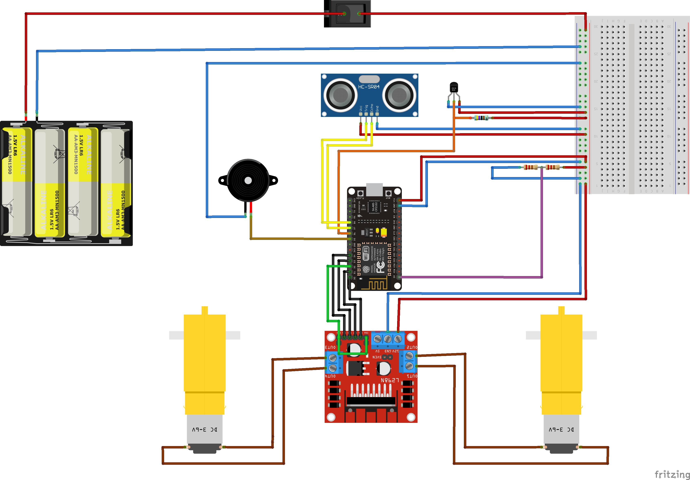

# WiFi Rover
Rover controlled via WiFi from Android app

 &emsp;  &emsp; 

Check the presentation for more info about the project ([english](WiFi_Rover-pres-en.pdf) and [greek](WiFi_Rover-pres-en.pdf) versions available) and see our [demo video](Wifi_Rover-demo.mp4).

## Components
- 2WD Smart Robot Car Chassis Kit ([[1]](https://modchip.gr/product/2wd-smart-robot-car-chassis-kit-for-arduino/), [[2]](https://grobotronics.com/robot-smart-car-2wd.html), or any chassis of your choice)
- [NodeMCU - Lua based ESP8266](https://grobotronics.com/nodemcu-lua-based-esp8266.html?sl=en)
- 2 x [DC Gear Motor TT](https://grobotronics.com/dc-gear-motor.html) and [wheels](https://grobotronics.com/rubber-wheel-66x26mm-yellow.html) (if not included in your kit)
- [Dual Motor Driver Module L298N](https://grobotronics.com/dual-motor-driver-module-l298n.html)
- [Ultrasonic Distance Sensor - HC-SR04](https://grobotronics.com/ultrasonic-sensor-sr04.html)
- [1-Wire DS18B20 Digital temperature sensor](https://grobotronics.com/ds18b20.html)
- [Buzzer 5V](https://grobotronics.com/buzzer-5v.html)
- [Rocker switch ON-OFF](https://grobotronics.com/rocker-switch-on-off.html) (or any other switch you like)
- 2 x 220Ω, 1 x 4.7kΩ resistors
- 4 x AA bateries and [battery holder](https://grobotronics.com/4x-with-wires.html) (if not included in your kit)
- Jumper wires and breadboard for connections

Estimated **total** cost: ~40E

## Apps and online services
- [Arduino IDE](https://www.arduino.cc/en/software)
- [MIT App Inventor](https://appinventor.mit.edu/) (optional)

## Instructions
1. Assemble the rover chassis and set up the circuit according to the [schematic](https://raw.githubusercontent.com/nikos-el/WiFi_Rover/main/WiFi_Rover-schematic.png) (the photos above _may_ be useful).
2. Upload the [source code](WiFi_Rover.ino) to your NodeMCU with the [Arduino IDE](https://www.arduino.cc/en/software). If this is your first project with NodeMCU ESP8266, check [here](https://create.arduino.cc/projecthub/electropeak/getting-started-w-nodemcu-esp8266-on-arduino-ide-28184f) for some extra instructions.
3. Download and install the [app](Wifi_Rover.apk) to your cell phone (_currently only Android phones supported_) OR build the app from its [source block-code](Wifi_Rover.aia) with the [MIT App Inventor](https://appinventor.mit.edu/).
4. Turn on the switch and connect your smartphone to the `WiFi_Rover` network-access point. The password is `123456789` (but if you want, you can change it from the source code).
5. _Play time!_

## Schematic

